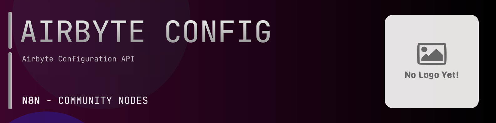

# @n8n-dev/n8n-nodes-airbyte-config



[](https://www.npmjs.com/package/@n8n-dev/n8n-nodes-airbyte-config)
[](https://opensource.org/licenses/MIT)

---

**Stop writing airbyte-config API integrations by hand.**

Every time you connect n8n to airbyte-config, you waste hours mapping endpoints, defining parameters, and debugging schemas. You copy-paste from docs, fix edge cases, and pray nothing breaks.

**What if connecting n8n to airbyte-config took 5 minutes, not half a day?**

This node gives you **22+ resources** out of the box: **Attempt**, **Internal**, **Workspace**, **Source Definition**, **Source Definition Specification**, and 17 more: with full CRUD operations, typed parameters, and zero manual configuration.

---

## What You Get

- **Zero boilerplate**: Resources, operations, and fields are pre-configured and ready to use
- **Full CRUD**: Create, read, update, and delete support where the API allows it
- **Typed parameters**: No more guessing field types
- **Built-in auth**: API key authentication, ready to go
- **Declarative**: Native n8n performance, no custom execute() overhead

---

## Install

```bash
npm install @n8n-dev/n8n-nodes-airbyte-config
```

**Or in n8n:**
1. **Settings → Community Nodes → Install**
2. Search: `@n8n-dev/n8n-nodes-airbyte-config`
3. Click **Install**

---

## Quick Start

1. Install the node (above)
2. Add credentials: **airbyte-config API** → paste your API key
3. Drag the **airbyte-config** node into your workflow
4. Pick a resource → pick an operation → done.

That's it. No configuration files. No code. It just works.

---

## Resources

<details>
<summary><b>Attempt</b> (3 operations)</summary>

- Post For worker to set sync stats of a running attempt
- Post For worker to save the AttemptSyncConfig for an attempt
- Post For worker to register the workflow ID in attempt

</details>

<details>
<summary><b>Internal</b> (6 operations)</summary>

- Post For worker to set sync stats of a running attempt
- Post For worker to save the AttemptSyncConfig for an attempt
- Post For worker to register the workflow ID in attempt
- Post Get normalization status to determine if we can bypass normalization phase
- Post Should only called from worker to write result from discover activity back to DB
- Post Create or update the state for a connection

</details>

<details>
<summary><b>Workspace</b> (9 operations)</summary>

- Post Creates a workspace
- Post Deletes a workspace
- Post Find workspace by ID
- Post Find workspace by connection ID
- Post Find workspace by slug
- Post List all workspaces registered in the current Airbyte deployment
- Post Update workspace feedback state
- Post Update workspace state
- Post Update workspace name

</details>

<details>
<summary><b>Source Definition</b> (11 operations)</summary>

- Post Creates a custom sourceDefinition for the given workspace
- Post Delete a source definition
- Post Get source
- Post Get a sourceDefinition that is configured for the given workspace
- Post grant a private non custom sourceDefinition to a given workspace
- Post List all the sourceDefinitions the current Airbyte deployment is configured to use
- Post List all the sourceDefinitions the given workspace is configured to use
- Post List the latest sourceDefinitions Airbyte supports
- Post List all private non custom sourceDefinitions and for each indicate whether the given workspace has a grant for using the definition Used by admins to view and modify a given workspace s grants
- Post revoke a grant to a private non custom sourceDefinition from a given workspace
- Post Update a sourceDefinition

</details>

<details>
<summary><b>Source Definition Specification</b> (1 operations)</summary>

- Post Get specification for a SourceDefinition

</details>

<details>
<summary><b>Source</b> (12 operations)</summary>

- Post Check connection to the source
- Post Check connection for a proposed update to a source
- Post Clone source
- Post Create a source
- Post Delete a source
- Post Discover the schema catalog of the source
- Post Get source
- Post List sources for workspace
- Post Get most recent ActorCatalog for source
- Post Search sources
- Post Update a source
- Post Should only called from worker to write result from discover activity back to DB

</details>

<details>
<summary><b>Destination Definition</b> (11 operations)</summary>

- Post Creates a custom destinationDefinition for the given workspace
- Post Delete a destination definition
- Post Get destinationDefinition
- Post Get a destinationDefinition that is configured for the given workspace
- Post grant a private non custom destinationDefinition to a given workspace
- Post List all the destinationDefinitions the current Airbyte deployment is configured to use
- Post List all the destinationDefinitions the given workspace is configured to use
- Post List the latest destinationDefinitions Airbyte supports
- Post List all private non custom destinationDefinitions and for each indicate whether the given workspace has a grant for using the definition Used by admins to view and modify a given workspace s grants
- Post revoke a grant to a private non custom destinationDefinition from a given workspace
- Post Update destinationDefinition

</details>

<details>
<summary><b>Destination Definition Specification</b> (1 operations)</summary>

- Post Get specification for a destinationDefinition

</details>

<details>
<summary><b>Destination</b> (9 operations)</summary>

- Post Check connection to the destination
- Post Check connection for a proposed update to a destination
- Post Clone destination
- Post Create a destination
- Post Delete the destination
- Post Get configured destination
- Post List configured destinations for a workspace
- Post Search destinations
- Post Update a destination

</details>

<details>
<summary><b>Connection</b> (9 operations)</summary>

- Post Create a connection between a source and a destination
- Post Delete a connection
- Post Get a connection
- Post Returns all connections for a workspace
- Post Returns all connections for a workspace including deleted connections
- Post Reset the data for the connection Deletes data generated by the connection in the destination Resets any cursors back to initial state
- Post Search connections
- Post Trigger a manual sync of the connection
- Post Update a connection

</details>

<details>
<summary><b>Destination OAuth</b> (3 operations)</summary>

- Post Given a destination def ID generate an access refresh token etc
- Post Given a destination connector definition ID return the URL to the consent screen where to redirect the user to
- Post Sets instancewide variables to be used for the OAUTH flow when creating this destination When set these variables will be injected into a connector s configuration before any interaction with the connector image itself This enables running OAUTH flows with consistent variables e g the company s Google Ads developer token client ID and client secret without the user having to know about these variables

</details>

<details>
<summary><b>Health</b> (1 operations)</summary>

- Get Health Check

</details>

<details>
<summary><b>Jobs</b> (7 operations)</summary>

- Post Cancels a job
- Post Get information about a job
- Post Gets all information needed to debug this job
- Post Get Last Replication Job
- Post Get information about a job excluding attempt info and logs
- Post Get normalization status to determine if we can bypass normalization phase
- Post Returns recent jobs for a connection Jobs are returned in descending order by createdAt

</details>

<details>
<summary><b>Logs</b> (1 operations)</summary>

- Post Get logs

</details>

<details>
<summary><b>Notifications</b> (1 operations)</summary>

- Post Try sending a notifications

</details>

<details>
<summary><b>Openapi</b> (1 operations)</summary>

- Get Returns the openapi specification

</details>

<details>
<summary><b>Operation</b> (6 operations)</summary>

- Post Check if an operation to be created is valid
- Post Create an operation to be applied as part of a connection pipeline
- Post Delete an operation
- Post Returns an operation
- Post Returns all operations for a connection
- Post Update an operation

</details>

<details>
<summary><b>Scheduler</b> (3 operations)</summary>

- Post Run check connection for a given destination configuration
- Post Run check connection for a given source configuration
- Post Run discover schema for a given source a source configuration

</details>

<details>
<summary><b>Source OAuth</b> (3 operations)</summary>

- Post Given a source def ID generate an access refresh token etc
- Post Given a source connector definition ID return the URL to the consent screen where to redirect the user to
- Post Sets instancewide variables to be used for the OAUTH flow when creating this source When set these variables will be injected into a connector s configuration before any interaction with the connector image itself This enables running OAUTH flows with consistent variables e g the company s Google Ads developer token client ID and client secret without the user having to know about these variables

</details>

<details>
<summary><b>Web Backend</b> (8 operations)</summary>

- Post Returns a summary of source and destination definitions that could be updated
- Post Create a connection
- Post Get a connection
- Post Returns all non deleted connections for a workspace
- Post Update a connection
- Post Returns available geographies can be selected to run data syncs in a particular geography The auto entry indicates that the sync will be automatically assigned to a geography according to the platform default behavior Entries other than auto are two letter country codes that follow the ISO 3166 1 alpha 2 standard
- Post Fetch the current state type for a connection
- Post Returns the current state of a workspace

</details>

<details>
<summary><b>State</b> (2 operations)</summary>

- Post Create or update the state for a connection
- Post Fetch the current state for a connection

</details>

---

## Why This Node?

**Without this node:**
- Hours of manual API integration
- Copy-pasting from airbyte-config docs
- Debugging auth, pagination, error handling
- Maintaining your own client code

**With this node:**
- Install → configure → use. 5 minutes.
- Auto-generated from the official airbyte-config OpenAPI spec
- Always up to date when the API changes
- Native n8n performance

---

## Auto-Generated
This node was auto-generated from the official **airbyte-config** OpenAPI specification using
[@n8n-dev/n8n-openapi-node-ultimate](https://github.com/kelvinzer0/n8n-openapi-node-ultimate),
then validated against the live API so you get accurate types and real parameters, not guesswork.

When the airbyte-config API updates, this node updates too.

---


## License

MIT © [kelvinzer0](https://github.com/n8n-code)
